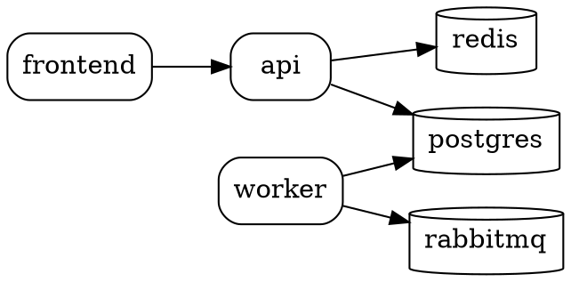

# Feature: `raioz graph` (Grafo de Dependencias)

## Resumen

Comando que visualiza el grafo de dependencias entre servicios e infraestructura definidos en `.raioz.json`. Genera una representacion ASCII por defecto (sin dependencias externas), con opciones para exportar en formato DOT (Graphviz) o JSON.

```bash
raioz graph                  # ASCII en terminal
raioz graph --format dot     # Formato DOT para Graphviz
raioz graph --format json    # JSON para uso programatico
raioz graph --format dot | dot -Tpng -o graph.png  # Generar imagen
```

## Valor para el desarrollador

**Onboarding en un proyecto nuevo:**
```
Sin graph:
1. Abrir .raioz.json                         (5 seg)
2. Leer cada servicio y sus depends_on       (2 min)
3. Dibujar mentalmente las conexiones        (3 min)
4. Preguntar al equipo "que depende de que?" (10 min)
Total: ~15 min para entender la topologia

Con graph:
1. raioz graph                               (1 seg)
2. Ver diagrama completo de un vistazo       (10 seg)
Total: ~11 seg — entendimiento inmediato
```

**Proyectos complejos (10+ servicios):**
- Identificar rapidamente que servicios dependen de una BD antes de migrar
- Detectar dependencias circulares que causan problemas en `raioz up`
- Documentar la arquitectura con `raioz graph --format dot | dot -Tsvg`

## Diseno tecnico

### Arquitectura

```
┌──────────────┐     ┌──────────────┐     ┌──────────────┐
│  ConfigLoader│────>│  GraphBuilder│────>│   Renderer   │
│  (.raioz.json)     │  (adjacency  │     │              │
└──────────────┘     │   list)      │     └──────┬───────┘
                     └──────────────┘            │
                                    ┌────────────┼────────────┐
                                    │            │            │
                               ┌────▼─────┐ ┌───▼──────┐ ┌──▼───────┐
                               │  ASCII   │ │   DOT    │ │   JSON   │
                               │ Renderer │ │ Renderer │ │ Renderer │
                               └──────────┘ └──────────┘ └──────────┘
```

### Componentes

#### 1. Graph Builder (`internal/graph/render.go`)

Construye la lista de adyacencia a partir de la configuracion:

```go
type Node struct {
    Name    string
    Kind    string   // "service", "infra"
    Edges   []string // nombres de nodos de los que depende
}

type Graph struct {
    Nodes map[string]*Node
}

// BuildFromConfig construye el grafo leyendo GetDependsOn() de cada servicio
func BuildFromConfig(services map[string]models.Service) *Graph
```

**Clasificacion de nodos:**
- `service`: servicios con source (`git`, `local`, `command`)
- `infra`: servicios con source tipo `image` (postgres, redis, rabbitmq, etc.)

#### 2. ASCII Renderer (`internal/graph/ascii.go`)

Renderer por defecto, sin dependencias externas. Usa caracteres box-drawing Unicode:

```go
// RenderASCII genera la representacion en texto plano del grafo
func RenderASCII(g *Graph, w io.Writer) error
```

Algoritmo de layout:
1. Ordenamiento topologico para asignar capas (nivel 0 = sin dependencias entrantes)
2. Servicios del mismo nivel se colocan en la misma fila
3. Flechas `-->` conectan nodos con sus dependencias
4. Nodos de infraestructura se marcan con `[ ]` en vez de `( )`

#### 3. DOT Renderer (`internal/graph/dot.go`)

Genera formato DOT compatible con Graphviz:

```go
// RenderDOT genera la representacion en formato Graphviz DOT
func RenderDOT(g *Graph, w io.Writer) error
```

#### 4. JSON Renderer (incluido en `render.go`)

Serializa el grafo como JSON para consumo programatico:

```go
// RenderJSON genera la representacion JSON del grafo
func RenderJSON(g *Graph, w io.Writer) error
```

### Formatos de salida

#### ASCII (por defecto)

```
billing-platform

frontend ──> api ──> postgres
                │
                └───> redis

worker ──> rabbitmq
           └───> postgres

Leyenda: ── dependencia de servicio  [ ] infraestructura
```

#### DOT (`--format dot`)



#### JSON (`--format json`)

```json
{
  "project": "billing-platform",
  "nodes": [
    {"name": "frontend", "kind": "service", "depends_on": ["api"]},
    {"name": "api", "kind": "service", "depends_on": ["postgres", "redis"]},
    {"name": "worker", "kind": "service", "depends_on": ["rabbitmq", "postgres"]},
    {"name": "postgres", "kind": "infra", "depends_on": []},
    {"name": "redis", "kind": "infra", "depends_on": []},
    {"name": "rabbitmq", "kind": "infra", "depends_on": []}
  ],
  "edges": [
    {"from": "frontend", "to": "api"},
    {"from": "api", "to": "postgres"},
    {"from": "api", "to": "redis"},
    {"from": "worker", "to": "rabbitmq"},
    {"from": "worker", "to": "postgres"}
  ]
}
```

### Flags del CLI

```go
graphCmd.Flags().StringVar(&format, "format", "ascii", "Output format: ascii, dot, json")
```

## Algoritmo

### 1. Construccion de la lista de adyacencia

```go
func BuildFromConfig(services map[string]models.Service) *Graph {
    g := &Graph{Nodes: make(map[string]*Node)}

    for name, svc := range services {
        kind := "service"
        if svc.Source.Kind == "image" {
            kind = "infra"
        }
        g.Nodes[name] = &Node{
            Name:  name,
            Kind:  kind,
            Edges: svc.GetDependsOn(),
        }
    }
    return g
}
```

### 2. Ordenamiento topologico (algoritmo de Kahn)

Usado para asignar capas al layout ASCII:

```
1. Calcular in-degree de cada nodo
2. Encolar nodos con in-degree 0 (raices)
3. Mientras la cola no este vacia:
   a. Sacar nodo, asignar capa actual
   b. Para cada vecino, decrementar in-degree
   c. Si in-degree llega a 0, encolar para siguiente capa
4. Si quedan nodos sin procesar → ciclo detectado
```

### 3. ASCII renderer

```
1. Agrupar nodos por capa (del topological sort)
2. Ordenar nodos dentro de cada capa alfabeticamente
3. Para cada nodo raiz (capa 0):
   a. Imprimir nombre del nodo
   b. Para cada dependencia, imprimir flecha (──>)
   c. Si hay multiples dependencias, usar bifurcacion (│ y └───>)
4. Imprimir leyenda al final
```

## Edge cases a manejar

| Caso | Comportamiento |
|------|---------------|
| Dependencias circulares | Detectar ciclo, imprimir warning con los nodos involucrados y renderizar el grafo sin las aristas que forman el ciclo |
| Servicios aislados (sin deps) | Mostrarlos en una seccion separada: `Servicios independientes: auth, cron` |
| Grafo grande (20+ servicios) | El ASCII puede ser dificil de leer. Sugerir `--format dot` para exportar a imagen |
| Dependencia a servicio no definido | Marcar la arista como rota: `api ──> ??? unknown-service` |
| Proyecto sin servicios | Mensaje: `No hay servicios definidos en .raioz.json` |
| Servicio sin depends_on | Tratarlo como nodo hoja (in-degree puede ser > 0 si otros dependen de el) |
| Nombres largos de servicio | Truncar a 20 caracteres en ASCII, nombre completo en DOT/JSON |
| Un solo servicio | Mostrar nodo aislado sin flechas |

## Archivos a crear

```
internal/graph/
├── render.go          # GraphBuilder, tipos Node/Graph, RenderJSON
├── ascii.go           # RenderASCII con topological sort y layout
├── dot.go             # RenderDOT para formato Graphviz
├── render_test.go     # Tests del builder y JSON renderer
├── ascii_test.go      # Tests del ASCII renderer
└── dot_test.go        # Tests del DOT renderer
```

## Cambios en archivos existentes

| Archivo | Cambio |
|---------|--------|
| `cmd/raioz/main.go` | Registrar subcomando `graph` |
| `cmd/graph.go` (nuevo) | Comando Cobra thin, flag `--format` |
| `internal/i18n/locales/en.json` | ~8 keys para mensajes de graph |
| `internal/i18n/locales/es.json` | Traducciones |

## Estimacion de complejidad

| Componente | Complejidad | Lineas estimadas |
|-----------|-------------|-----------------|
| Graph builder + tipos | Baja | ~50 |
| ASCII renderer | Media | ~80 |
| DOT renderer | Baja | ~40 |
| JSON renderer | Baja | ~20 |
| CLI command | Baja | ~30 |
| i18n | Baja | ~16 |
| Tests | Baja | ~120 |
| **Total** | | **~356 lineas** (~200 de logica, ~156 de tests) |

## Riesgos

1. **Grafos ciclicos:** El algoritmo de Kahn no puede completar el sort si hay ciclos. Se detecta porque quedan nodos sin procesar. Mitigacion: detectar el ciclo, emitir warning, y remover una arista del ciclo para poder renderizar.

2. **Layout ASCII limitado:** Para grafos densos con muchas aristas cruzadas, el ASCII se vuelve ilegible. Mitigacion: recomendar `--format dot` cuando el grafo tiene mas de 15 nodos o mas de 20 aristas.

## Criterios de aceptacion

- [ ] `raioz graph` muestra el grafo ASCII en terminal
- [ ] `raioz graph --format dot` genera DOT valido (parseable por Graphviz)
- [ ] `raioz graph --format json` genera JSON valido con nodos y aristas
- [ ] Servicios de infraestructura (`image`) se distinguen visualmente de servicios
- [ ] Dependencias circulares se detectan y se muestra un warning claro
- [ ] Servicios aislados se listan por separado
- [ ] Dependencias a servicios no definidos se marcan como rotas
- [ ] Funciona sin dependencias externas (ASCII puro)
- [ ] Mensajes de usuario pasan por `i18n.T()`
- [ ] Tests unitarios para builder, ASCII renderer, DOT renderer y JSON renderer
- [ ] Cada archivo cumple el limite de 400 lineas
